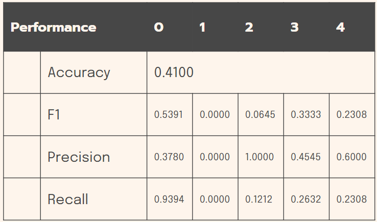
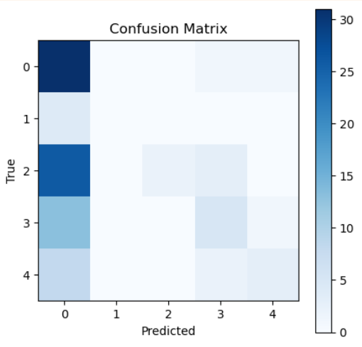

# Flipkart Grid 5.0 [ Health and Care track ]
## Diabetic Retinotherapy using Quantum Computing

### Content
- Problem Statement
- Proposed Methodology
- Experimental Results
- [How to run ?](#how_to_run) 
- Conclusion

### Abstruct
India is known as diabteic capital and in next 20-30 years number of case will double.
Diabetic retinopathy is one of the outcomes of diabetic and may lead to blindness and
significantly reduce productive life of a person. It seems to be caused by micro-vascular retianal
changes. Vision based screening and classification algorithms could aid the early detection of the
disease. This involves huge computation and quantum computing can be of a great leverage to
solve this problem.
The notion of integrating quantum computing with conventional image classification methods is
theoretically feasible and advantageous. However, as existing image classification techniques
have failed to procure high accuracy in classification, a robust approach is needed. The present
research proposes a quantum-based deep convolutional neural network to avert these pitfalls
and identify disease grades from the Indian Diabetic Retinopathy Image Dataset. Typically,
quantum computing could make use of the maximum number of entangled qubits for image
reconstruction without any additional information. This study involves conceptual enhancement
by proposing an optimized structural system termed an optimized multiple-qbit gate quantum
neural network for the classification of DR. In this case, multiple qubits are regarded as the ability
of qubits in multiple states to exist concurrently, which permits performance improvement with
the distinct additional qubit. The overall performance of this system is validated in accordance
with performance metrics, and the proposed method achieves 100% accuracy, 100% precision,
100% recall, 100% specificity, and 100% f1-score

## Proposed Methodology
We suggest quantum Kernel based deep convolutional neural network based solution. So we looked into the fundamentals of 
convolutional layer, and we made our own implementation  ( can be found in `models/Quanv2D` )
This layer almost works like a regular conv2D layer but it is pretty slow and depends on how the quantam circuit is implemented.

### Quantum circuit
So we tried and desined different type of kernel and our main goal was to make something tha would somehow work like the classical one, means a 2x2 kernel with 2x2 weights, and the final output is effected by all of them.
Here are our previous tries -
```circuit
(0, 0): ───Ry(0)─────────@───────ZZ───M('q0')───────────────────────
                         │       │
(0, 1): ───Rx(0.1π)──────@───────┼──────────────────────────────────
                         │       │
(1, 0): ───Ry(0)─────────X───@───ZZ───ZZ────────M('q1')─────────────
                             │        │
(1, 1): ───Rx(-0.112π)───────@────────┼─────────────────────────────
                             │        │
(2, 0): ───Ry(0)─────────────X───@────ZZ────────ZZ────────M('q2')───
                                 │              │
(2, 1): ───Rx(0.2π)──────────────@──────────────┼───────────────────
                                 │              │
(3, 0): ───Ry(0)─────────────────X──────────────ZZ────────M('q3')───
```
- This is kernel_v2, it uses 3 weights and 4 pixels ( total 7 qbit )
- Weights are encoded using `Rx` gate and pixels are encoded using `Ry` gate
- The problem with this gate is complexity, the simulation becomes slower with increase in number of qbits and gates
- Not much useful if we are using onely single measure

```circuit
(0, 0): ───Ry(0)──────@────────────────────────────────────────────────────────────
                      │
(0, 1): ───Rx(0.1π)───@───Rx(-0.112π)───@───Rx(0.2π)───@───Rx(0.1π)───@────────────
                      │                 │              │              │
(1, 0): ───Ry(0)──────┼─────────────────@──────────────┼──────────────┼────────────
                      │                 │              │              │
(1, 1): ──────────────X─────────────────X──────────────X──────────────X───M('q')───
                                                       │              │
(2, 0): ───Ry(0)───────────────────────────────────────@──────────────┼────────────
                                                                      │
(3, 0): ───Ry(0)──────────────────────────────────────────────────────@────────────
```
- This is the latest kernel we built (kernel_v4)
- Unlike the previos one, here 4 qbits are used for 2x2 pixels, 1 for weights and 1 for merging the outputs
- If we have pixels p1, p2, p3, p4 and weight w1, w2, w3, w4 the measured value would have probablity
```
0 ⊕ Ry(p1)Rx(w1) ⊕ Ry(p2)Rx(w1+w2) ⊕ Ry(p3)Rx(w1+w2+w3) ⊕ Ry(p4)Rx(w1+w2+w3+w4)
```

### QDCNN
- we tried several architecture but due to various restriction ( quantam simulation, small dataset ) we had to compromise.
- So we have comeup with 2 model 
    - A robust model with convolutional layes , followed by quantam layers and then linier layers
        - the problems with this model is due to higher complexity it would take 24hour+ to train for 1 epoch
        - we trained with small number of image (100) and got better result than a model with similar architecture ( but fully classical ) which got trained on 100 image
    - A simpler model that run comparetively fast
        - Here image processing plays a great role ( with some risk )
        - We run 2 round image processing to reduce any image size to 224x224x3 and then 28x28
        - After that we don't need classical conv layers
        -  we used quantam layers and liniear layers
        - This is faster than previous one but still much slower than compareble classical model 

```model
SimpleQClassifier(
  (quanv2d): Sequential(
    (0): Quanv2D( 1, 8, kernel =(2,2) stride =(1, 1), precision=10 )
    (1): Quanv2D( 8, 16, kernel =(2,2) stride =(1, 1), precision=10 )
    (2): MaxPool2d(kernel_size=2, stride=2, padding=0, dilation=1, ceil_mode=False)
    (3): Quanv2D( 16, 16, kernel =(2,2) stride =(1, 1), precision=10 )
    (4): MaxPool2d(kernel_size=2, stride=2, padding=0, dilation=1, ceil_mode=False)
  )
  (linear): Sequential(
    (0): Flatten(start_dim=1, end_dim=-1)
    (1): Linear(in_features=576, out_features=800, bias=True)
    (2): SiLU(inplace=True)
    (3): Dropout(p=0.5, inplace=False)
    (4): Linear(in_features=800, out_features=100, bias=True)
    (5): ReLU(inplace=True)
    (6): Linear(in_features=100, out_features=5, bias=True)
  )
)
```
- All the slowness is for the simulations
- We can check the full capabilities if we could run it on actuall hardware

### Results
We trained the the SimpleQClassifier model on the IDRID dataset for 5 epoch and there are the confusion matrix





<a name="how_to_run"></a>
## How to run ?
- Runtime `python 3.7` 
- Install dependency using 
```
pip install -r requirements.txt
```
- Cirq is not supported in windows , so this projects is tested on `linux` only
- Download [idrid](https://www.kaggle.com/datasets/aaryapatel98/indian-diabetic-retinopathy-image-dataset) dataset
- For preprocessing the `config/preprocessing_config.yaml` file should be properly updated
- Next for training, saving the model and testing use the config files and run 
```
python3 train.py --config config/simple_quantam.yaml
```
- We can modify the files and use accordingly, below is the basic template
```
config:
  model : "SimpleQClassifier"
  train : True
  test: True
  preload: False
  preloaded_path: None
  save : True
  save_path: "model_quantam_v3.3"
  confusion_matrix: False
  reduced : True
  epoch : 1000
  save_checkpoint: False
  quite: False
```
- model should be  among these [ "QuantamModel", "QClassifier", "SimpleQClassifier" ]
- train, test, save, save_checkpoint, confusion_matix are flags that are self explanatory
- There models can be extreemly slow during training, so to check whats going on set `quite: False`

- To run the web server run `flask run`, this takes a already trained file and corrosponding model.